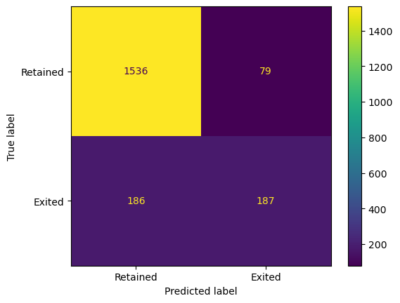

# Customer Churn Prediction

This project focuses on predicting customer churn for a bank using a variety of machine learning models. The dataset contains information on customers, and the goal is to identify which customers are likely to leave the bank.

## Dataset

The dataset used in this project is `Churn_Modelling.csv`, which contains the following features:

- **CreditScore**: Customer's credit score
- **Geography**: Customer's country
- **Gender**: Customer's gender
- **Age**: Customer's age
- **Tenure**: Number of years the customer has been with the bank
- **Balance**: Customer's account balance
- **NumOfProducts**: Number of products the customer has with the bank
- **HasCrCard**: Whether the customer has a credit card (1 = Yes, 0 = No)
- **IsActiveMember**: Whether the customer is an active member (1 = Yes, 0 = No)
- **EstimatedSalary**: Customer's estimated salary
- **Exited**: Whether the customer churned (1 = Yes, 0 = No)

## Project Structure

The project is organized as follows:

1. **Data Cleaning and Preprocessing**: The data is cleaned, irrelevant columns are removed, categorical variables are encoded, and numerical features are standardized.
2. **Exploratory Data Analysis**: Various visualizations are created to understand the distribution and relationships of the features.
3. **Model Evaluation**: Multiple machine learning models are trained and evaluated, including:
    - Logistic Regression
    - Decision Tree
    - Random Forest
    - Support Vector Machine
    - K-Nearest Neighbors
    - Naive Bayes
    - Neural Networks
    - Ensemble Models (e.g., AdaBoost, Bagging, Gradient Boosting, etc.)
    - XGBoost
    - CatBoost
4. **Model Selection**: The best-performing model is selected based on accuracy, and a confusion matrix is plotted to visualize the results.

## Requirements

The following Python libraries are required for the project:

- pandas
- seaborn
- matplotlib
- scikit-learn
- xgboost
- catboost

You can install the necessary packages using:

```bash
pip install pandas seaborn matplotlib scikit-learn xgboost catboost
```

## How to Run

To run the Jupyter Notebook containing the project code, follow these steps:

Ensure you have Jupyter Notebook installed. If not, you can install it using pip:

```bash
pip install notebook
```

Navigate to the directory containing the Jupyter Notebook file (Banking_Customer_Churn_Prediction.ipynb) using the command line.

Launch Jupyter Notebook by running the following command:

```bash
jupyter notebook
```

This will open a new tab in your web browser showing the Jupyter file explorer. Click on the Banking_Customer_Churn_Prediction.ipynb file to open it.

Inside the notebook, you can execute each cell by clicking on it and then pressing Shift + Enter. Alternatively, you can run all cells at once by selecting Cell > Run All from the menu bar.

Follow the instructions and comments within the notebook to understand the workflow and analyze the results.

## Results

The best-performing model in this project was the **CatBoost Classifier**. The results were evaluated using accuracy and a confusion matrix was plotted to visualize the performance.



## Made by
<p> João Alves - up202108670@up.pt
<p> Alberto Serra - up202103627@up.pt
<p> Eduardo Sousa - up202103342@up.pt

